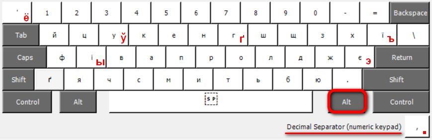

# Ukrainian extended keyboard layout for Windows

This layout is created from standard Windows Ukrainian (Enhanced) layout
using [Microsoft Keyboard Layout Creator (MSKLC) Version 1.4](https://www.microsoft.com/en-us/download/details.aspx?id=102134)

## Added characters

THe layout offers letters from Ukrainian, Bielorussian, and Russian alphabets.

Bonus: decimal point on NumPad (by default it offers comma on Ukrainian layout).

| Target Character | Key Sequence |
| :----:    | :----: |
|           | _AltGr+[Shift]+_ |
| ґҐ | гГ |
| ўЎ | уУ |
| ёЁ | '~ |
| ъЪ | їЇ |
| ыЫ | іІ |
| эЭ | єЄ |
| .  | , (NumPad) |

## Installation

Download and run [MSI installer for x64](https://bit.ly/kbd-Ukr-Extended-x64).
It is recommended to pass it through Windows Defender
or 3p antivirus software (avoid Kaspersky products).
