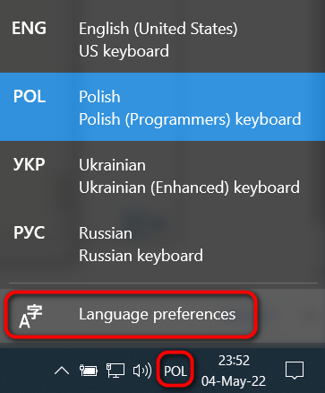
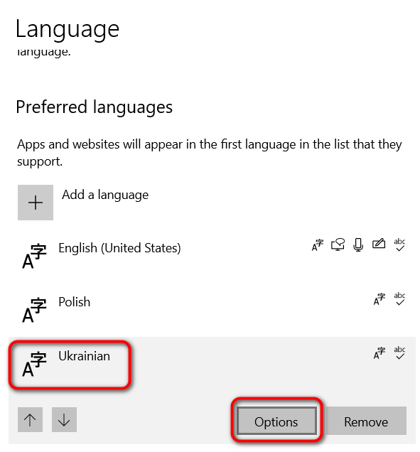
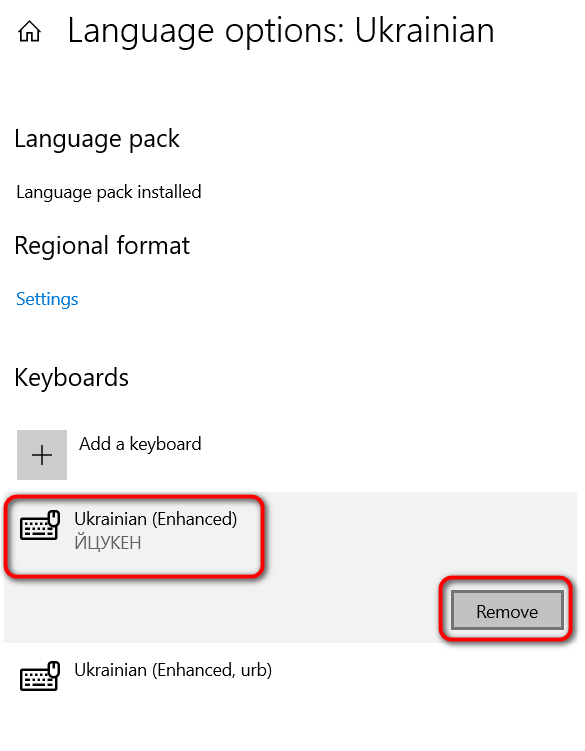

# Ukrainian extended keyboard layout for Windows

This layout is created from standard Windows Ukrainian (Enhanced) layout
using [Microsoft Keyboard Layout Creator (MSKLC) Version 1.4](https://www.microsoft.com/en-us/download/details.aspx?id=102134)

## Added characters

THe layout offers letters from Ukrainian, Bielorussian, and Russian alphabets.

Bonus: decimal point on NumPad (by default it offers comma on Ukrainian layout).

| Target Character | Key Sequence |
| :----:    | :----: |
|           | _AltGr+[Shift]+_ |
| ґҐ | гГ |
| ўЎ | уУ |
| ёЁ | '~ |
| ъЪ | їЇ |
| ыЫ | іІ |
| эЭ | єЄ |
| .  | , (NumPad) |

## Installation

Download [the distribution package](https://bit.ly/kbd-Ukr-Win-Extended),
unpack and run `setup.exe`.

> It is recommended to pass the package through Windows Defender
> or 3p antivirus software (avoid Kaspersky products).

Open Language preferences. Pick Ukrainian and remove simple Enhanced layout.

You may need to restart your computer for the changes to take effect, 
as Windows handles its in a weird way
(or the build by MSKLC is not fully compatible with Windows 10+).

